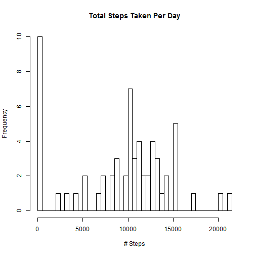
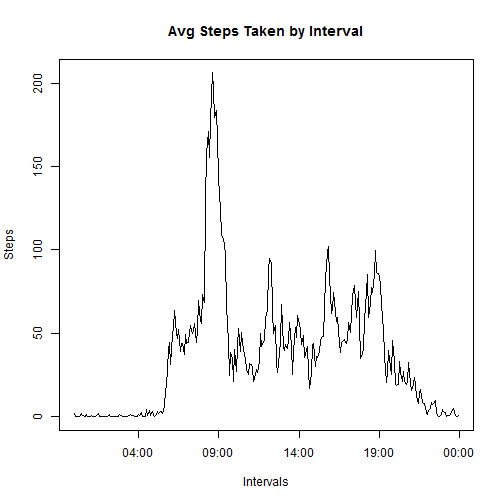
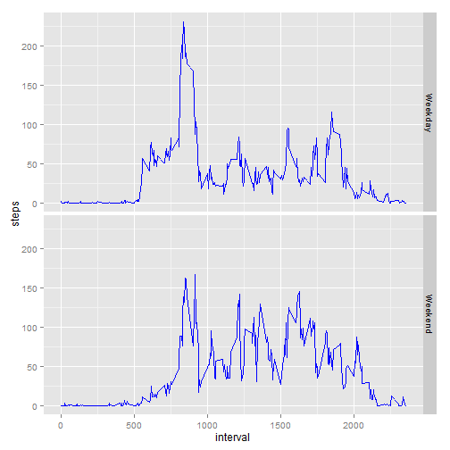

## Loading and preprocessing the data

The data was unzipped and loaded into R using following:


```r
unzip("repdata-data-activity.zip")
data <- read.csv("activity.csv")
```

## What is mean total number of steps taken per day?


```r
library(dplyr)
activity<-group_by(data, date)
TotalSteps<-summarize(activity, steps=sum(steps,na.rm=TRUE))
hist(TotalSteps$steps, breaks=61, main="Total Steps Taken Per Day", xlab="# Steps")
```

 

The mean and median of the total number of steps taken per day are:

```r
mean(TotalSteps$steps, na.rm=TRUE)
```

```
## [1] 9354.23
```

```r
median(TotalSteps$steps, na.rm=TRUE)
```

```
## [1] 10395
```

## What is the average daily activity pattern?
The average number of steps taken averaged across all days is depicted in the time series plot below:

```r
avgIntSteps<-tapply(data$steps, data$interval, mean, na.rm=TRUE)
intervals<- strptime(sprintf("%04d", as.numeric(names(avgIntSteps))), format="%H%M")
plot(intervals, avgIntSteps, type="l", breaks=5, xlab="Intervals", ylab="Steps", main="Avg Steps Taken by Interval")
```

 

The 5-minute interval that has the maximum number of steps, on average across all the days in the dataset, was 835. 

```r
maxIndex<-which(avgIntSteps %in% max(avgIntSteps))
names(avgIntSteps)[maxIndex]
```

```
## [1] "835"
```

## Imputing missing values
The number of missing values in the data set was calculated to be 2304. 


```r
numNA<-sum(is.na(data$steps))
```

The presence of missing days may introduce bias into some calculations or summaries of the data. To account for this, we created a new data set with the missing data filled in with the mean of the corresponding 5-minute interval.


```r
# took avg steps calculated from previous question and changed it into a data frame and added column names
avgIntSteps2<-data.frame(names(avgIntSteps),avgIntSteps)
colnames(avgIntSteps2)<-c("interval", "steps")

# create new dataset of activity data
data2<- read.csv("activity.csv")

# create impute function which fills in missing values with corresponding intervals means
impute<-function(steps,interval){
  Means <-c()
  if(is.na(steps)) 
    Means<-c(avgIntSteps2[avgIntSteps2$interval==interval,"steps"])
  else
    Means<-c(steps)
  
}

data2$steps<-mapply(impute, data2$steps, data2$interval)
```

The total number of steps taken each day are depicted in the histogram below. The mean and median total number of steps taken per day were both calculated to be 10766 which was higher than the estimates from the first question. This is because missing values in the original data set were treated as 0s so it resulted in a lower mean and median. 

```r
activity2<-group_by(data2, date)
TotalStep2<-summarize(activity2, steps=sum(steps))
hist(TotalStep2$steps, breaks=61, main="Total Steps Taken Per Day", xlab="# Steps")
```

 

```r
mean(TotalStep2$steps)
```

```
## [1] 10766.19
```

```r
median(TotalStep2$steps)
```

```
## [1] 10766.19
```

## Are there differences in activity patterns between weekdays and weekends?
A new factor variable was created with two levels, "weekday" and "weekend".

```r
data2$dayofweek<-weekdays(as.Date(data2$date))

data2$dayofweek[data2$dayofweek=="Sunday"]<-"Weekend"
data2$dayofweek[data2$dayofweek=="Saturday"]<-"Weekend"
data2$dayofweek[data2$dayofweek=="Monday"]<-"Weekday"
data2$dayofweek[data2$dayofweek=="Tuesday"]<-"Weekday"
data2$dayofweek[data2$dayofweek=="Wednesday"]<-"Weekday"
data2$dayofweek[data2$dayofweek=="Thursday"]<-"Weekday"
data2$dayofweek[data2$dayofweek=="Friday"]<-"Weekday"

data2$dayofweek<-as.factor(data2$dayofweek)
```

A panel plot was created to show  the 5-minute interval and the average number of steps taken across all weekday and weekend days.

```r
library(ggplot2)

paneldata<-group_by(data2, dayofweek, interval)
AvgSteps<-summarize(paneldata,steps=mean(steps))
ggplot(AvgSteps, aes(x=interval, y=steps))+geom_line(color="blue")+facet_grid(dayofweek~.)
```

 
